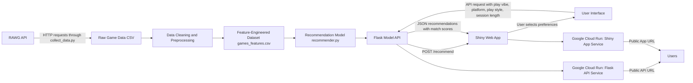

# Video Game Recommender

## Project Overview

This is an interactive recommendation app that helps you find the right game to play based on your current mood and situation. Instead of just showing popular games, the app learns what you're looking for—whether you want something chill, competitive, story-driven, or puzzle-focused. You select your play vibe, platform, gaming style (solo or multiplayer), and how much time you have, and the app recommends games with match scores showing how well they fit your preferences.

The recommendations are built from game data collected from the RAWG API, which includes metadata like genres, tags, platforms, ratings, playtime, and images.


## Deployed Services

Deployed Shiny App:  
https://gamematch-shiny-127112588159.us-central1.run.app

Deployed Flask API:  
https://gamematch-api-127112588159.us-central1.run.app

Example API health check:

```bash
curl https://gamematch-api-127112588159.us-central1.run.app/health
```

Example API recommendation request:

```bash
curl -X POST https://gamematch-api-127112588159.us-central1.run.app/recommend \
  -H "Content-Type: application/json" \
  -d '{"play_vibe":"Story-Driven","platform":"PC","play_style":"Solo","session_length":"Medium session","top_n":5}'
```

## How to Use the App

1. Open the deployed Shiny app: https://gamematch-shiny-127112588159.us-central1.run.app
2. Select your preferences:
   - **Play vibe:** What mood are you in? (Chill, Competitive, Story-Driven, Puzzle, Creative)
   - **Platform:** Where do you want to play? (PC, PlayStation, Xbox, Nintendo Switch)
   - **Play style:** Solo or Multiplayer/Co-op?
   - **Session length:** How much time do you have? (Short, Medium, Long)
   - **Recommendations:** How many games do you want to see? (3-10)
3. Click "Find games"
4. View the recommendations with match scores, titles, ratings, and images

## Data Collection

I collected around 500 games from the RAWG API. The data includes game ID, name, release date, rating, metacritic score, playtime, genres, tags, platforms, stores, and cover images. See `src/collect_data.py` for the collection script and `data/raw/rawg_games_raw.csv` for the raw data.

## Feature Engineering

I created three main features from the raw data since RAWG doesn't directly provide what I needed:

**Play Vibe** - The mood or feeling of a game (Chill/Cozy, Competitive/Intense, Story-Driven, Puzzle/Strategy, Creative/Exploration). Each game gets one primary play vibe based on its genres and tags.

**Play Style** - Whether games support solo play and/or multiplayer/co-op. A game can have both labels (like Minecraft).

**Session Length** - How long a typical play session is (≤1 hour, 1-3 hours, 3+ hours). I created this from genres, tags, and RAWG's playtime data. Many games had missing playtime, so I treated those as unknown rather than zero.

Processing happens in `src/preprocess.py`, which creates `data/processed/games_features.csv`.

## Exploratory Data Analysis

The EDA is in `notebooks/eda.ipynb` and covers dataset overview, missing values, duplicate checking, distributions for genres/tags/platforms/ratings/playtime, and how many games fit each play vibe and session length category.

A key finding: many games had zero playtime in RAWG, so I didn't rely solely on that number. Instead, I used genres and tags to estimate session length.

## Recommendation Model

I used a weighted scoring approach instead of a traditional ML model. This makes recommendations transparent and easy for users to understand. The model is in `src/recommender.py`.

The scoring weights are:
- Play vibe: 45%
- Play style: 20%
- Session length: 15%
- RAWG rating: 15%
- Confidence in ratings (rating counts): 5%

Platform acts as a hard filter—only games on your selected platform are recommended, but platform doesn't contribute to the match score.

See `src/evaluate_model.py` for evaluation, which checks that recommendations match selected criteria and that scores are reasonable.

## API & Web Application

**Flask API** (`api/app.py`) has three endpoints:
- `GET /` - Basic API message
- `GET /health` - Health check
- `POST /recommend` - Returns game recommendations

**Shiny App** (`app/app.py`) is the web interface where users select preferences and see recommendations with match scores, game titles, ratings, and images. It communicates with the Flask API via HTTP requests.

## Solution Architecture Diagram

The diagram below shows the full system architecture and data flow.



## Local Setup

```bash
# Clone and set up environment
git clone YOUR_REPO_URL
cd YOUR_REPO_NAME
python3 -m venv .venv
source .venv/bin/activate
pip install -r requirements.txt

# Add your RAWG API key to .env
RAWG_API_KEY=your_key_here

# Run the pipeline
python3 src/collect_data.py      # Collect from RAWG API
python3 src/preprocess.py        # Process data
python3 src/evaluate_model.py    # Test recommendations

# Run locally
python3 api/app.py  # In one terminal (port 8000)
# In another terminal:
GAMEMATCH_API_URL=http://127.0.0.1:8000 shiny run --reload --port 8001 app/app.py
```

Then visit `http://127.0.0.1:8001` in your browser.

## Testing

Run the recommender tests:

```bash
python3 -m pytest tests/
```

This runs unit tests for the recommendation model to ensure it returns valid recommendations and that scores are reasonable.

## Docker

```bash
# API container
docker build -t gamematch-api .
docker run -p 8080:8080 gamematch-api

# Shiny container (in another terminal)
docker build -f Dockerfile.shiny -t gamematch-shiny .
docker run -p 8081:8080 -e GAMEMATCH_API_URL=http://host.docker.internal:8080 gamematch-shiny
```

## Project Structure

```text
video-game-recommender
├── api/
│   └── app.py
├── app/
│   └── app.py
├── data/
│   ├── raw/
│   │   └── rawg_games_raw.csv
│   └── processed/
│       ├── games_clean.csv
│       └── games_features.csv
├── notebooks/
│   └── eda.ipynb
├── src/
│   ├── collect_data.py
│   ├── preprocess.py
│   ├── recommender.py
│   └── evaluate_model.py
├── tests/
│   └── test_recommender.py
├── Dockerfile
├── Dockerfile.shiny
├── cloudbuild-shiny.yaml
├── requirements.txt
├── .env.example
└── README.md
```

## AI Assistant Usage

I used ChatGPT and Claude throughout this project. ChatGPT helped me brainstorm the project scope, plan the structure, debug connection issues between Flask and Shiny, and write documentation. Claude in VS Code helped with code generation, feature engineering functions, and improving code structure.

**Key prompts that worked well:**
- "How can I create play vibe categories from game tags and genres?"
- "My app works locally but needs to call the deployed Flask API from Shiny. How do I set up the environment variable?"

**Where AI was most helpful:** Connecting different pieces together. I had the data collection, recommender, API, and Shiny app as separate components, but AI helped me think through how to integrate them and solve deployment issues.

**Code I significantly modified:**
- **Play vibe feature:** AI generated code that assigned multiple play vibes per game, which made match scores too high. I changed it so each game has one primary play vibe.
- **Play style feature:** AI initially forced each game to be either solo OR multiplayer, but games like Minecraft support both. I made it multi-label.
- **UI improvements:** I removed excessive explanations, adjusted spacing, and made the app cleaner based on testing.

**Lessons learned:**
- AI is great for getting started and solving specific problems, but always check the logic and test the results.
- Detailed instructions matter. When I said "a game should only have one primary play vibe" or "don't show reasons in the recommendation cards," the AI outputs improved significantly.
- AI accelerated development, but I still needed to make final decisions, verify correctness, and test the user experience. It's a tool, not a replacement for thinking.

## Challenges & Lessons Learned

**Missing features:** RAWG doesn't directly provide play vibe or session length. I solved this by creating these from tags, genres, platforms, and playtime data.

**Missing data:** Many games had zero playtime. I treated this as unknown and used broader session length categories instead of exact playtime.

**Score inflation:** Early versions gave too many games very high match scores. I fixed this by making platform a hard filter and ensuring each game has only one primary play vibe.

**Key lesson:** A simpler, more transparent model that users understand is better than a complex one they don't trust. I focused on making the app clear and interactive rather than maximizing model sophistication.

## Future Improvements

- Add user skill level (beginner, intermediate, advanced)
- Include price/budget filtering if reliable data becomes available
- Expand the game dataset
- Add "like" or "not interested" feedback buttons
- Use an LLM to help label ambiguous play vibes
- Store user search history and feedback in a database
- User testing with real players for better evaluation

